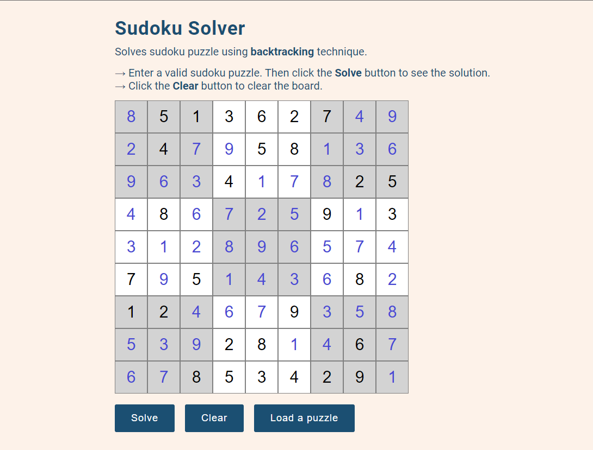

# Sudoku-Solver

Sudoku puzzle solver using backtracking technique.\
[Live Demo](https://sudokoo.netlify.app/)

## Input a valid sudoku puzzle:

## See the solution:

## Todos:
* Show appropriate message on invalid input
* Show backtracking steps
